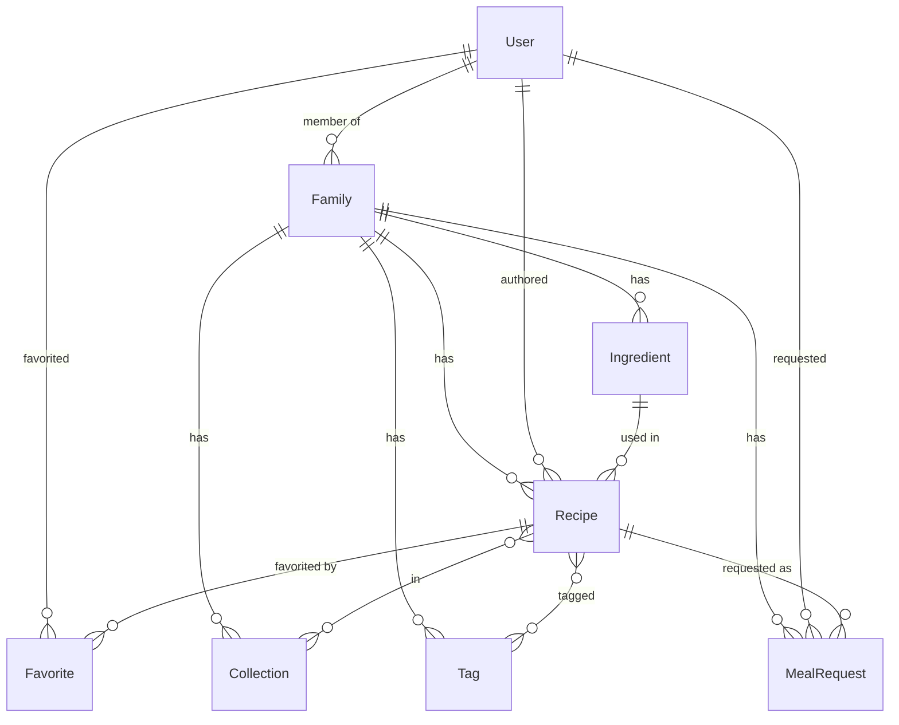

# Yummy -- Обновленный план проекта (v2)

Это обновление к [предыдущему плану](yummy_project_architecture_plan_f2169f2e.plan.md). Здесь описаны изменения и дополнения.

---

## 1. Ключевые решения

- **Коллекции остаются** как ручные подборки ("На новый год", "Любимое мамы"). Работают рядом с тегами. Коллекция = ручная группировка, тег = категоризация
- **Теги** -- отдельная сущность в БД (справочник), привязана к семье
- **Ингредиенты** -- отдельная сущность в БД (справочник), привязана к семье

---

## 2. Новые/измененные модели данных

### 2.1 Tag (НОВАЯ сущность)

```
Tag {
  name: string (required)         -- "Итальянская кухня", "Быстрое", "Веган"
  familyId: ObjectId (ref: Family)
}
```

- Уникальность: `name + familyId` (один тег на семью)
- При создании рецепта пользователь выбирает из существующих тегов или создает новый "на лету"
- Рецепт хранит `tags: ObjectId[]` вместо `tags: string[]`

**Бэкенд:**

- Файлы: `yummy-api/src/tags/` -- schema, repository, service, controller, module, dto
- Эндпоинты:
  - `GET /tags` -- все теги семьи (для автокомплита, без пагинации -- их обычно немного)
  - `POST /tags` -- создать тег (проверка уникальности name+familyId)
  - `DELETE /tags/:id` -- удалить тег (только если не используется или с подтверждением)

**Фронтенд:**

- `yummy-web/src/pages/tags/tagsApi.ts` -- RTK Query endpoints
- В RecipeModal (DishModal): Select с режимом `tags` + кнопка создания нового -> вместо свободного ввода подсказки из справочника

### 2.2 Ingredient (НОВАЯ сущность)

```
Ingredient {
  name: string (required)           -- "Свекла", "Куриное филе", "Молоко"
  familyId: ObjectId (ref: Family)
}
```

- Уникальность: `name + familyId`
- Это справочник имен. Количество (`amount`) хранится в рецепте, не в справочнике.

**Бэкенд:**

- Файлы: `yummy-api/src/ingredients/` -- schema, repository, service, controller, module, dto
- Эндпоинты:
  - `GET /ingredients?query=мол` -- поиск ингредиентов семьи (для автокомплита)
  - `POST /ingredients` -- создать ингредиент
  - `DELETE /ingredients/:id` -- удалить (проверить использование)

**Фронтенд:**

- `yummy-web/src/pages/ingredients/ingredientsApi.ts` -- RTK Query endpoints
- В RecipeModal: при добавлении ингредиента -- Select с поиском из справочника + возможность создать новый

### 2.3 Recipe (Dish) -- обновленная схема

Изменения относительно предыдущего плана:

```
Recipe {
  name: string (required)
  description: string
  ingredients: [{
    ingredientId: ObjectId (ref: Ingredient),   -- ссылка на справочник
    amount: string                               -- "2 шт", "300 г"
  }]
  steps: [{ order: number, text: string }]
  cookingTime: number                            -- минуты
  servings: number
  difficulty: EASY | MEDIUM | HARD
  tags: ObjectId[] (ref: Tag)                    -- ссылки на справочник вместо string[]
  sourceUrl: string
  category: BREAKFAST | FIRST | SECOND | SALAD | SOUP | DESSERT | DRINK | SNACK | OTHER  -- НОВОЕ
  familyId: ObjectId (ref: Family)
  authorId: ObjectId (ref: User)
  collections: ObjectId[] (ref: Collection)
  createdAt: Date
  updatedAt: Date
}
```

**Новое поле `category`** -- тип блюда. В отличие от тегов (произвольные), категория -- фиксированный enum. Помогает при фильтрации ("покажи все супы") и при MealRequest ("хочу десерт на ужин").

### 2.4 Collection -- обновленная схема

Без изменений относительно предыдущего плана:

```
Collection {
  name: string (required)
  description: string
  familyId: ObjectId (ref: Family)
  createdBy: ObjectId (ref: User)
  coverIcon: CoverIconEnum
}
```

Убираем `allowedUsers[]`. Доступ через Family.

### 2.5 Family, User, MealRequest

Без изменений относительно предыдущего плана.

---

## 3. Дополнительные улучшения (новые идеи)

### 3.1 Избранное (Favorites)

Простая фича -- каждый член семьи может отметить рецепт как "избранное". Персональное, не семейное.

**Реализация:** Отдельная коллекция в MongoDB (не вложенное поле в Recipe, чтобы не менять чужие рецепты):

```
Favorite {
  userId: ObjectId (ref: User)
  recipeId: ObjectId (ref: Recipe)  
  createdAt: Date
}
```

- Уникальный индекс: `userId + recipeId`
- `POST /favorites/:recipeId` -- добавить в избранное (toggle)
- `DELETE /favorites/:recipeId` -- убрать из избранного
- `GET /favorites` -- мои избранные рецепты (пагинация)
- На карточке рецепта: иконка сердца (заполненная/пустая)
- На странице рецептов: фильтр "Только избранное"

### 3.2 Категории блюд (Category enum)

Фиксированный набор категорий для классификации:

- `BREAKFAST` -- Завтрак
- `FIRST` -- Первое
- `SECOND` -- Второе  
- `SALAD` -- Салат
- `SOUP` -- Суп
- `DESSERT` -- Десерт
- `DRINK` -- Напиток
- `SNACK` -- Перекус/Закуска
- `OTHER` -- Другое

В RecipeModal: обязательное поле (Select). В списке рецептов: фильтр по категории. На MainPage: при создании MealRequest можно указать категорию вместо конкретного рецепта.

### 3.3 Список покупок (Shopping List) -- перспектива

Можно будет добавить позже: из одобренных MealRequest за день/неделю автоматически собирать список ингредиентов. Пока не реализуем, но архитектура ингредиентов как справочника это позволит.

---

## 4. Обновленная структура файлов бэкенда

Новые модули в `yummy-api/src/`:

```
tags/
  schemas/tag.schema.ts
  dto/tag.dto.ts, create-tag.dto.ts
  tags.repository.ts
  tags.service.ts
  tags.controller.ts
  tags.module.ts
  models.ts

ingredients/
  schemas/ingredient.schema.ts
  dto/ingredient.dto.ts, create-ingredient.dto.ts
  ingredients.repository.ts
  ingredients.service.ts
  ingredients.controller.ts
  ingredients.module.ts

favorites/
  schemas/favorite.schema.ts
  dto/favorite.dto.ts
  favorites.repository.ts
  favorites.service.ts
  favorites.controller.ts
  favorites.module.ts
```

Регистрация в [yummy-api/src/app.module.ts](yummy-api/src/app.module.ts): добавить `TagsModule`, `IngredientsModule`, `FavoritesModule`, `FamiliesModule`, `MealRequestsModule`.

---

## 5. Обновленный фронтенд

### API файлы (новые):

- `yummy-web/src/pages/tags/tagsApi.ts`
- `yummy-web/src/pages/ingredients/ingredientsApi.ts`
- `yummy-web/src/pages/favorites/favoritesApi.ts`
- `yummy-web/src/pages/families/familiesApi.ts`
- `yummy-web/src/pages/meal-requests/mealRequestsApi.ts`

### RecipeModal (DishModal) -- обновленные поля:

- `name` -- InputFormItem (required)
- `description` -- TextAreaFormItem
- `category` -- SelectFormItem с enum значениями (required)
- `difficulty` -- DifficultyFormItem (required)
- `cookingTime` -- InputNumber ("мин")
- `servings` -- InputNumber
- `tags` -- Select mode="multiple" с поиском из `GET /tags` + возможность создать новый
- `ingredients` -- Form.List, каждая строка:
  - Select с поиском из `GET /ingredients?query=...` + создать новый
  - Input для amount ("2 шт", "300 г")
  - Кнопка удаления строки
- `steps` -- Form.List, каждая строка:
  - Номер (авто)
  - TextArea
  - Кнопка удаления
- `sourceUrl` -- Input

Учитывая размер формы -- реализовать как **Drawer** (выезжающая панель) вместо модалки, или как Ant Design **Steps** (степпер: 1. Основное, 2. Ингредиенты, 3. Приготовление).

### DishCard -- обновления:

- Показывать: cookingTime (иконка часов), servings, category
- Иконка сердца (избранное) -- toggle
- Теги отображать по имени (populate из справочника)

### Список рецептов -- фильтры:

- По категории (category enum)
- По сложности (difficulty)
- По времени готовки (cookingTime ranges)
- По тегам (multiselect из справочника)
- Переключатель "Только избранное"
- Поиск по названию

---

## 6. Обновленный порядок реализации

**Фаза 1 -- Ядро (Family + справочники + расширенный рецепт):**

1. Модель Family + CRUD + inviteCode + FamilyPage
2. Модели Tag и Ingredient (справочники) + CRUD API
3. Расширение модели Dish (ingredients как ссылки, tags как ссылки, category, cookingTime, servings, sourceUrl, steps, authorId, familyId)
4. RecipeModal (Drawer/Steps) с полями ингредиентов и шагов
5. RecipeDetailPage (`GET /dishes/:id`)
6. Адаптация Collection (allowedUsers -> familyId)

**Фаза 2 -- Выбор еды + избранное:**
7. Модель MealRequest + API
8. MainPage дашборд "Сегодня"
9. MealRequestModal
10. Модель Favorite + API + иконка на карточке

**Фаза 3 -- Доработки:**
11. ProfilePage (displayName, статистика)
12. SettingsPage (язык, тема)
13. Фильтры и поиск на странице рецептов
14. AddDishesModal (поиск рецептов для коллекции)
15. Навигация: добавить "Семья" в меню

---

## 7. Визуализация архитектуры данных




